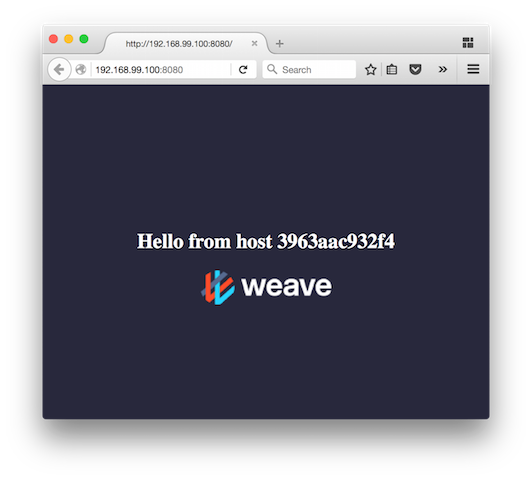

This is a guide to getting a minimal Flux system running. It assumes
only that you have a host running Docker -- to get to that point, you
can [install Docker][docker-install], or use
[docker-machine][docker-machine] to create a VM on which to run it.

I'll take some shortcuts here, in particular by using prepared images
for some of the prerequisites. This is just so we can proceed quickly
to "kicking the tires".

## Prerequisites

First we'll set up a couple of environment variables for things we'll
use repeatedly. We need a host IP address for whatever is running
Flux, and an address for things to find `etcd` on. The host IP needs
to be accessible from inside Docker containers, so `localhost` (or
`127.0.0.1`) won't do; the IP address assigned to your host on the
local network will do the trick, or if you're using Docker on a VM,
the address assigned to that VM.

```sh
# I got this by looking at the output of ifconfig
$ export HOST_IP=192.168.3.165
# If using docker-machine, use something like
# export HOST_IP=$(docker-machine ip flux)
```

OK, now let's run the two bits of infrastructure we need: etcd and
Prometheus. We'll run them in containers, of course.

```sh
$ docker run --name=etcd -d -p $HOST_IP::2379 quay.io/coreos/etcd \
       --listen-client-urls http://0.0.0.0:2379 \
       --advertise-client-urls=http://localhost:2379
# ...
$ export ETCD_ADDRESS=http://$(docker port etcd 2379)

# And run our pre-baked image of Prometheus
$ docker run --name=prometheus -d -e ETCD_ADDRESS -p $HOST_IP::9090 \
       weaveworks/flux-prometheus-etcd
# ...
$ export PROMETHEUS_ADDRESS=http://$(docker port prometheus 9090)
```

Now we have both etcd and prometheus, and (in the environment entries)
what we need to tell Flux so it can reach them.

## Starting Flux

Flux includes a script to start and stop the Flux components, but
we're going to do it by hand here so we can see what are the moving
parts. It's not much more complicated.

First, the agent:

```sh
$ docker run --name=fluxagent -d -e ETCD_ADDRESS \
       -v /var/run/docker.sock:/var/run/docker.sock \
       weaveworks/flux-agent --host-ip $HOST_IP
```

The agent needs to know where etcd is, and needs to be able to connect
to the Docker socket, to detect containers starting and stopping. It
also needs to know what IP address containers will be reachable on --
in this case, the host IP from before, and the kind of network the
containers will run on.

Now, the balancer:

```sh
$ docker run --name=fluxbalancer -d -e ETCD_ADDRESS \
       --net=host --cap-add=NET_ADMIN \
       weaveworks/flux-balancer \
       --listen-prometheus=:9000 \
       --advertise-prometheus=$HOST_IP:9000
```

The balancer needs to run in the host's network namespace
(`--net=host`), and to have the `NET_ADMIN` capability so it can use
iptables. We also tell it to serve prometheus metrics
(`--listen-prometheus`) and supply the address on which those will be
reachable (`--advertise-prometheus`, again with the host IP address).

Flux is now running, and you can check this in Docker:

```sh
$ docker ps
CONTAINER ID        IMAGE                             COMMAND                  CREATED             STATUS              PORTS                                                         NAMES
64a9b5cf4290        weaveworks/flux-balancer          "/home/flux/server --"   3 seconds ago       Up 3 seconds                                                                      fluxbalancer
893f7e238473        weaveworks/flux-agent             "/bin/dlisten --host-"   22 seconds ago      Up 21 seconds                                                                     fluxagent
# ...
```

## Trying it out

Now we'll actually use Flux! Once it's running, you control Flux with
`fluxctl`. This is available as a Docker image. We'll drive it using
an alias, to avoid typing the `docker run ...` bit again and again:

```sh
$ alias fluxctl="docker run --rm -e ETCD_ADDRESS weaveworks/flux-fluxctl"
```

To try it out, see what `fluxctl info` gives us:

```sh
$ fluxctl info
# nothing ...
```

Nothing -- but since we haven't done anything yet, no errors is all we
should expect. You can try `fluxctl info` at each stage that follows
to see how it reports the state of the system.

We'll start by creating a service `hello`, which will represent some
hello-world containers we'll run presently.

```sh
$ fluxctl service hello --address 10.128.0.1:80 --protocol=http
$ fluxctl select hello default --image weaveworks/hello-world
```

The first command defines the service, gives it an address, and tells
Flux that it should treat traffic to the service as HTTP (the default
is just TCP). The second command adds a rule called `default`, that
will select containers using the image `weaveworks/hello-world` to be
instances of the service; i.e., to handle requests to the service
address ( `--port-mapped` bit says our hello-world containers will
have a port mapped to `80`, and that's how they should be reached).

Let's start some of those containers.

```sh
$ docker run -d -P weaveworks/hello-world
# ...
$ docker run -d -P weaveworks/hello-world
# ...
$ docker run -d -P weaveworks/hello-world
# ...
```

Now we can see if Flux has noticed them:

```sh
$ fluxctl info
hello
  RULES
    default {"image":"weaveworks/hello-world"}
  INSTANCES
    ccc5ed490a6a6d7d7ee4381857da752f38d995eb08a9a60f19ec946599d76511 192.168.1.129:32770 live
    3b84320f7958a7159f0d172b8408bb6953f8dfa49e425708377de34c9a97ee08 192.168.1.129:32771 live
    eba9d0a13a2d6d735a47f2b4e32ead6f6e15e11400b96b15ab566f325fd0574d 192.168.1.129:32772 live
```

Neat. Let's check if we can get an actual web page up.

```sh
$ docker run --rm tutum/curl sh -c 'while true; do curl -s http://10.128.0.1/; done'
# ... aaaah lots of output ...
^C
```

How about seeing it in a browser? Well, at the moment Flux is only
exposing the service on the service address, and that's only available
locally on the hosts Flux is running on (a bit like 127.0.0.1). If we
want to expose the service on an externally-accessible address, we can
run an edge balancer -- so called because it runs on the edge of your
application, making it available to clients.

```sh
$ docker run -p 8080:80 -d -e ETCD_ADDRESS -e SERVICE=hello \
    weaveworks/flux-edgebal
```

Now you should be able to see the service by pointing a browser at
`http://$HOST_IP:8080/`.



[docker-install]: https://docs.docker.com/engine/installation/
[docker-machine]: https://docs.docker.com/machine/install-machine/
