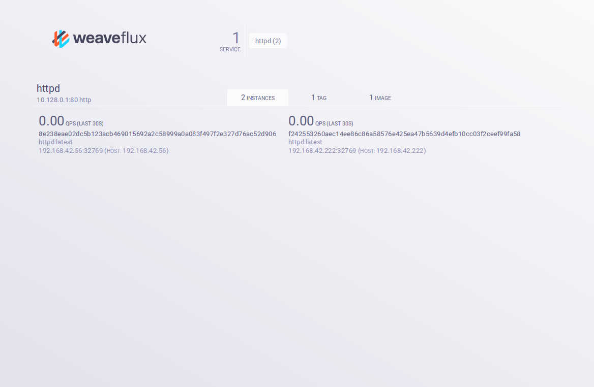

This is a step-by-step guide to using Weave Flux with [Docker
Swarm](https://www.docker.com/products/docker-swarm).  We'll use Swarm
because it spreads containers across a cluster of machines, while
retaining a developer experience that is very close to that of the
plain Docker Engine on a single host.  So it should be possible to
follow this guide if you are familiar with Docker, even if you don't
know Swarm.  And these instructions are not hugely Swarm-specific, so
some parts will be relevant to using Flux in other contexts.

* ToC
{:toc}

# Preliminaries

First, we'll create a Swarm cluster.  We'll use [Docker
Machine](http://www.docker.com/products/docker-machine) to do
this. Docker Machine is a tool that makes it simple to spin up docker
host VMs, and it has some built-in support for Swarm.  See Docker's
[instructions on creating a Swarm development
cluster](https://docs.docker.com/swarm/install-manual/) for more
details.  Here we'll create a modest cluster of two VMs (replacing
`$driver` with the Docker Machine driver you wish to use):

```sh
$ cluster_id=$(docker run --rm swarm create)
$ docker-machine create -d $driver --swarm --swarm-master \
        --swarm-discovery token://$cluster_id swarm-master
Running pre-create checks...
Creating machine...
[...]
Configuring swarm...
Checking connection to Docker...
Docker is up and running!
To see how to connect Docker to this machine, run: docker-machine env swarm-master
$ docker-machine create -d $driver --swarm \
        --swarm-discovery token://$cluster_id swarm-node-0
Running pre-create checks...
Creating machine...
[...]
```

Then we set the environment so the `docker` client command talks to
our Swarm cluster, rather than the local Docker Engine, and check that
it is working ok:

```sh
$ eval $(docker-machine env --swarm swarm-master)
$ $ docker run --rm hello-world

Hello from Docker.
[...]

```

# Deploying Flux

In this section, we'll deploy the basic Flux components to the Swarm
cluster.

etcd is a prerequisite for Flux, so first we start it in a container.
This is just a trivial single-node etcd deployment; if you have a
production etcd deployment already, you can set `$ETCD_ADDRESS` to
point to it instead.

```sh
$ docker run --name=etcd -d -P quay.io/coreos/etcd -listen-client-urls http://0.0.0.0:2379 -advertise-client-urls=http://localhost:2379
a43f43b6f2958a3143a7c15643b42329768551b87858e965ab2f64b30ce8ac2d
$ export ETCD_ADDRESS=http://$(docker port etcd 2379)
```

Next we start the Flux components (see the [Overview](/overview/)).
First the agent.  The agent container must be run on each host, so we
ask `docker-machine` to list the hosts and use a Swarm scheduling
constraint to run an agent on each.

```sh
$ hosts=$(docker-machine ls -f '{{.Name}}')
$ for h in $hosts ; do \
        docker run -d -e constraint:node==$h -e ETCD_ADDRESS \
            -v /var/run/docker.sock:/var/run/docker.sock \
            weaveworks/flux-agent -host-ip $(docker-machine ip $h) ; \
  done
6004ddd81bbcf01cb8fa4214546ad12c198fc96dccdd8f0573f9583bc25d9a79
df705d7e3a3c8b7a1c4e95b9e6c2d005f9bae2088155ac637f0d88802318b014
```

The balancer container must also be run on each host:

```sh
$ for h in $hosts ; do \
        docker run -d -e constraint:node==$h -e ETCD_ADDRESS \
        --net=host --cap-add=NET_ADMIN weaveworks/flux-balancer \
        -listen-prometheus=:9000 \
        -advertise-prometheus=$(docker-machine ip $h):9000 ; \
  done
16e619123598383612472fce2069390cfa035caf744a8b2b4de0be5b19997362
211e3a2bb782e63531a9dd2a5f9bc31f772805d657d8122d259fa27dde18b570
```

You have now deployed Flux!

# A simple service example with httpd and curl

In this section, we'll define a service consisting of some Apache
httpd containers, and then send requests to the service with curl.  In
practical use, clients and service instances connected by Flux are
more likely to be microservices within an application.  But httpd and
curl provides a simple way to demonstrate the basic use of Flux.

First, we'll use the `fluxctl service` administrative command to
define a *service*.  Services are the central abstraction of Flux.

```sh
$ docker run --rm -e ETCD_ADDRESS weaveworks/flux-fluxctl service httpd \
        --address 10.128.0.1:80 --protocol http
```

Here, we have defined a service called `httpd`.  The `--address
10.128.0.1:80` option assigns that IP address and port to the
service. This is a *floating address*; it doesn't correspond to any
host, but when clients attempt to connect to it, their connection will
be transparently forwarded to a service instance (so you should ensure
that the addresses you assign to services do not correspond to any
real IP addresses in your network environment).  The `--protocol http`
option tells Flux that connections to this service will carry HTTP
traffic, so that it can extract HTTP-specific metrics.

Next, we'll start a couple of httpd containers (note that we need to
use the `-P` option to `docker run` to make the ports exposed by the
container accessible from all machines in the cluster):

```sh
docker run -d -P httpd
docker run -d -P httpd
```

Flux does not yet know that these containers should be associated with
the service.  We tell it that by defining a *selection rule*, using
the `fluxctl select` command:

```sh
docker run --rm -e ETCD_ADDRESS weaveworks/flux-fluxctl select httpd default \
        --image httpd --port-mapped 80
```

This specifies that containers using the Docker image `httpd` should
be associated with the `httpd` service, with connections to the
service forwarded to port 80 of the container.

We can see the result of this using the `fluxctl info` command:

```sh
$ docker run --rm -e ETCD_ADDRESS weaveworks/flux-fluxctl info
httpd
  RULES
    default {"image":"httpd"}
  INSTANCES
    8e238eae02dc5b123acb469015692a2c58999a0a083f497f2e327d76ac52d906 192.168.42.56:32769 live
    f242553260aec14ee86c86a58576e425ea47b5639d4efb10cc03f2ceef99fa58 192.168.42.222:32769 live
```

Now we'll use `curl` to send a request to the service:

```sh
$ docker run --rm tutum/curl curl -s http://10.128.0.1/
<html><body><h1>It works!</h1></body></html>
```

Flux load-balances requests across the service instances, so this
request might have been served by either httpd container.

# The Flux web UI

Flux features a web-based UI.  This section explains how to get
started with it.

The Prometheus time series database is a prerequisite for the UI.  So
first we start it in a container:

```sh
$ docker run --name=prometheus -d -e ETCD_ADDRESS -P weaveworks/flux-prometheus-etcd
```

(The `flux-prometheus-etcd` image is a version of Prometheus
configured to integrate with the other components of Flux via etcd.)

Next we start the Flux web UI, telling it how to connect to Prometheus:

```sh
$ export PROMETHEUS_ADDRESS=http://$(docker port prometheus 9090)
$ docker run --name=flux-web -d -e ETCD_ADDRESS -e PROMETHEUS_ADDRESS -P \
    weaveworks/flux-web
```

Now we can point a browser to the address given by `docker port
flux-web 7070` in order to view the UI:



Here we see information about the service, including the instances
associated with it.  By selecting some instances, the UI will show
a chart of their request rates on the service.

We can use the `curl` container image to produce a stream of requests
to the service:

```sh
$ docker run --rm tutum/curl sh -c 'while true ; do curl -s http://1128.0.1/ >/dev/null ; done'
```

Then view the request rates as a chart:


If we change the URL used in the curl command to one that does not
exist, the chart shows the change in HTTP status code indicating the
error:


